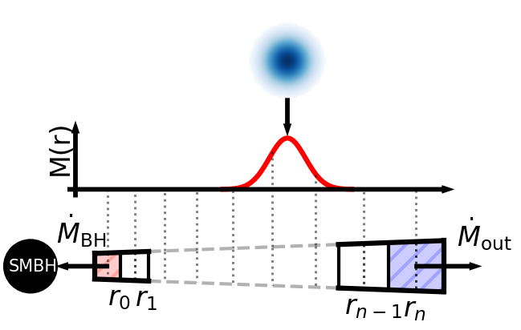

# accretiondisc

A simple model of a thin alpha-accretion disc. We use [Paczyńsk-Wiita](https://ui.adsabs.harvard.edu/abs/1980A&A....88...23P) (PW) potential :
$$
\phi = -\frac{\rm{G}M_{\rm BH}}{R-R_g}
$$
to arrive at and solve the viscous diffusion equation:
$$
\frac{\partial \Sigma}{\partial t} = \frac{3}{R}\frac{\partial }{\partial R} \left[ \frac{(R - R_{\rm g})^2}{R^{1/2}(R-3R_{\rm g})}\
 \frac{\partial}{\partial R} \left ( \nu \Sigma R^{3/2} \frac{R-\frac{1}{3}R_{\rm g}}{(R-R_{\rm g})^2} \right )  \right],
$$
assuming a stable thin accretion disc.

Accretion disc is fed by distributing packets of gas over annuli comprizing in the viscinity of some chosen radius.
<p align="center">

</p>

This is meant to iliustrate accretion of SPH particles onto an accretion disc sink particle used in hydrodynamical code *Gadget-3*.

## Installation

Package is managed with _Poetry_:
```bash
poetry install
```
_Poetry_ should manage dependencies automatically. If for whatever reason it does not a combination of:
* numba
* numpy
* matplotlib
is required to run the model and examples, although _matplotlib_ is only used for plotting.

## Usage

The main model dataclass and functions are in `disc.py`. Model makes use of code units and some constants found in `units.py`. 

A quick example below:
```python
import accretiondisc.disc as ad
import accretiondisc.units as unt

# accretion disc is initiated with 
# (default values in given example in code units)
disc = ad.Disc(
    bh_mass=0.8,  # SMBH mass
    n_rings=200,  # number of rings comprizing the disc
    mdot=0,  # SMBH accretion rate
    mesc=0,  # amount of matter that escaped the disc
    rin=1.147e-06,  # inner boundary, assumed ISCO
    rout=0.01,  # outer boundary
    ctime=0.01,  # courant factor
    disc_alpha = 0.1,  # accretion disc alpha (~0.1 is ok)
    h_r_init=0.002,  # height to radius ratio
    PW=True  # using Paczyńsky-Wiita potential
    )        # diffusion reduces to Kepler if False


# a simulation of steady accretion over a period 
# of time is performed with "do_the_evolution" function; 
# it returns disc object at the last step and some storage arrays
(disc,  # disc object 
 sigma_arr,  # surface density
 ring_luminosity_from_teff_arr,  # luminosity from Teff 
 ring_luminosity_from_mdot_arr,  # luminosity from mdot
 nu_arr,  # viscosity
 tau_arr,  # optical depth
 bh_mass_arr,  # SMBH mass
 mesc_arr,  # escaped mass
 mass_arr,  # mass of the disc (sigma * area)
 bh_mdot_arr,  # SMBH accretion rate
 temperature_effective_arr,  # effective temperature
 temperature_center_arr,  # central temperature
 current_time_arr  # time in code units
 ) = ad.do_the_evolution(
     disc,  # disc object 
     total_time=75,  # total time of simulation run
     fraction_of_time_feed=0.2,  # fraction of time that the disc is fed
     total_mass_to_feed=0.02,  # total mass fed to the disc
     dt=5e-3,  # "outer" timestep - intervals between 
             # disc feeding, diffusion step determination and data storage
     mass_portion=8e-8,  # size of mass portion (discrete SPH particle)
     hsml=0.01,  # smoothing lenght (minimum in an SPH simulation)
     r_circ=0.003  # mass insertion radius
     )
```

An example of a unit mass spreading by diffusion in a disc with constant viscosity is in `examples/diffusion_example.py`. Results should be compared Fig. 5.1. (page 83) [Accretion Power in Astrophysics](https://ui.adsabs.harvard.edu/abs/2002apa..book.....F) or Fig. 1. from [Accretion discs in astrophysic](http://adsabs.harvard.edu/abs/1981ARA%26A..19..137P10.1146/annurev.aa.19.090181.001033)

An example of steadily accreting disc model is in `examples/steady_accretion_example.py`.

## License

See the [LICENSE](LICENSE.md) file for license rights and limitations (MIT).